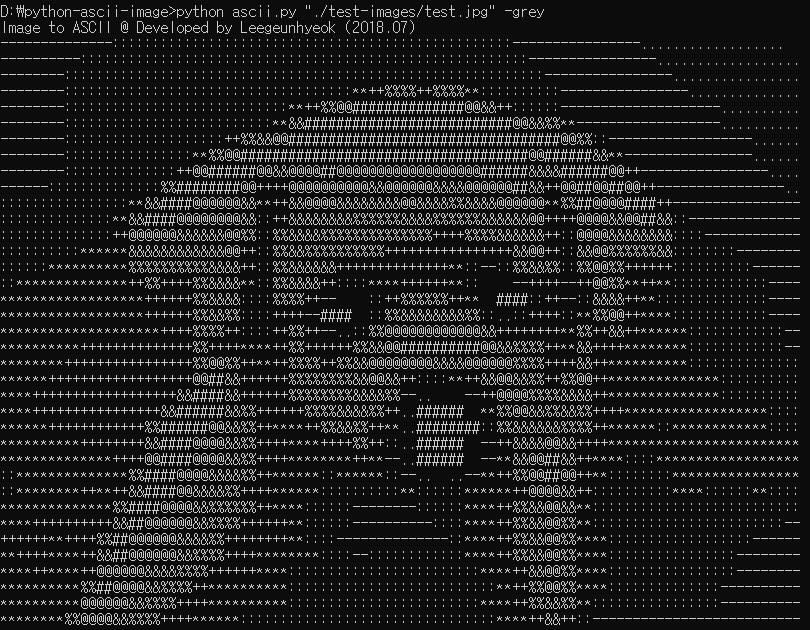

# Image to ASCII
이미지를 아스키 텍스트로 변환하는 프로그램입니다.

## 의존성 모듈
본 프로그램은 `PIL`, `colorama` 라이브러리를 사용합니다.
```bash
# PIL 설치
pip install pillow

# colorama
pip install colorama
```

## 실행 방법
```bash
python ascii.py "이미지 경로" -옵션
```


### 흑백모드
```bash
# 옵션 생략 시 흑백(-grey)으로 출력됩니다.
python ascii.py "./test-images/test.jpg"

# 위와 같은 결과
pythob ascii.py "./test-images/test.jpg" -grey
```



### 컬러모드
```bash
# 컬러 모드로 출력
python ascii.py "./test-images/test.jpg" -color
```


## 정보
- 개발자: [Leegeunhyeok](https://github.com/leegeunhyeok)
- MIT 라이센스